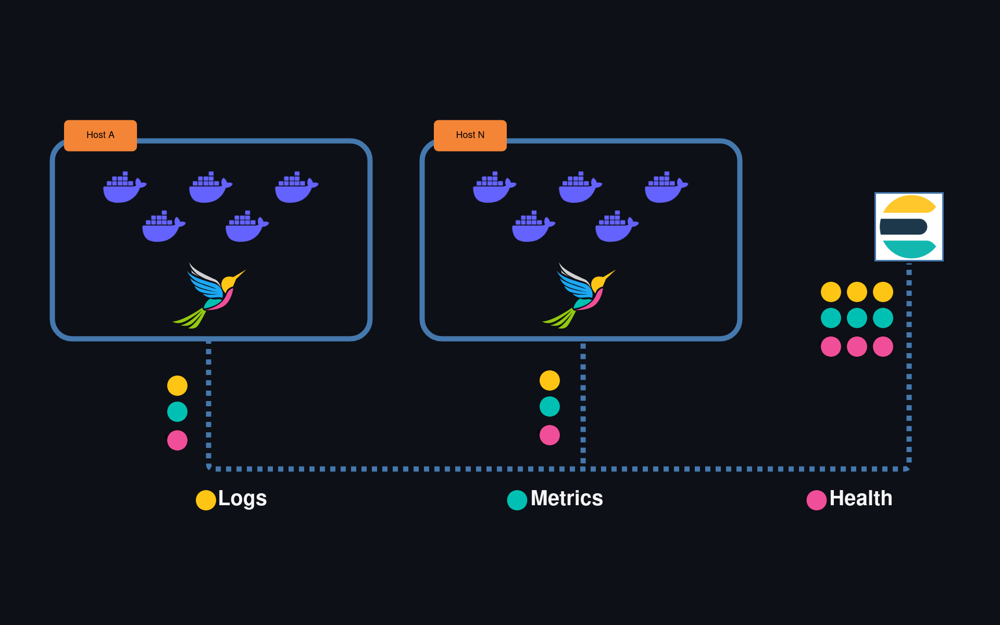

# Description


`Fluent Beats` is a set of observability pipelines for **Docker Containers** and **Linux Hosts**, compatible with **Elastic** observabilily features based on [FluentBit](https://fluentbit.io/)


# Requirements

* [Docker](www.docker.com)

# Supported Orchestrators
- [Docker Swarm Mode](https://docs.docker.com/engine/swarm/)
- [AWS ECS](https://docs.aws.amazon.com/ecs/)

# Elastic Supported Features

`Fluent Beats` uses the **Elastic Common Schema** to send data that can be ingested and consumed in key Kibana contexts

## Fully supported contexts

- Analytics
  - Dashboard
  - Discovery
  - Canvas
  - etc
- Observability
  - Alerts
  - Logs
  - Infrastructure
    - Metrics Explorer
    - Hosts
## Partially supported contexts
- Observability
  - Infrastructure
    - Inventory
      - AWS and K8s filters are not supported
  - Uptime
    - Uptime Monitors
      - Only container over TCP (translated from healthchecks)
## Unsupported contexts
  - APM
  - User Experience

# Design



This service is designed to provide lightweight observability capababilities for microservices running as Docker containers.

Its was designed to be deployed as a [Docker Swarm Global Service](https://docs.docker.com/engine/swarm/services/#replicated-or-global-services); or [AWS ECS equivalent](https://docs.aws.amazon.com/AmazonECS/latest/developerguide/ecs_services.html#service_scheduler_daemon); in order to receive any type of observability information from other services.

Internally it translates all metrics and logs to [Elastic ECS](https://www.elastic.co/guide/en/ecs/current/index.html), which is the standard schema used by **Elasticsearch**

## Requirements

To work properly it requires:

* Port bindings:
    * `2020/tcp`: Used to expose internal HTTP server
    * `24224/tcp`: Used to receive Logs from Docker Fluentd Driver
    * `8125/udp`: Used to receive Metrics/APM using extended StatsD datagrams (StatsD  + Tags)
* Volume bindings:
    * `/var/run/docker.sock`: Used to call Docker engine API
    * `/var/lib/docker/containers`: Used to detect all container running in the host
    * `/proc`: Used to extract host metrics (cpu, memory and load)

## Provided configs

The service can be configured based on a set of **environment variables** that basically define limits for the **Fluent Bit** engine.

These variables can be easily stored as [Environment File](https://docs.docker.com/compose/environment-variables/env-file/) and exported as [Docker Configs](https://docs.docker.com/engine/swarm/configs/)

The supported variables are:

 Variable                      | Description                                                                                    | Default
-------------------------------|------------------------------------------------------------------------------------------------|------------------
 FLB_DOCKER_METRICS_INTERVAL   | Time in seconds to collect Docker metrics                                                      | 10
 FLB_HOST_METRICS_INTERVAL     | Time in seconds to collect Host metrics                                                        | 10
 FLB_MEM_BUF_LIMIT             | Memory threshold for input plugins backpressure control                                        | 3M
 FLB_FORWARD_BUF_CHUNK_SIZE    | Allocation block size used by `forward` input plugin                                           | 1M
 FLB_FORWARD_BUF_MAX_SIZE      | Memory limit for a message received by `forward` input plugin                                  | 3M
 FLB_STORAGE_BACKLOG_MEM_LIMIT | Memory limit for backlog (unprocessed data) processing                                         | 10M
 FLB_DOCKER_IN_BUF_SIZE        | Size of the buffer used by Docker plugins to fetch data (in bytes or [unit sized](https://docs.fluentbit.io/manual/administration/configuring-fluent-bit/unit-sizes))                                                                                                                   | 30K
 FLB_HOST_NET_INTERFACE        | Name of the host network interface to monitor                                                  | eth0
 FLB_COLLECT_CONTAINER_LABELS  | Enable Docker container labels collection                                                      | false

## Provided pipelines

- [APM](https://github.com/fluent-beats/fluent-beats/blob/master/docs/pipelines/apm.md)
- [Docker Container Info](https://github.com/fluent-beats/fluent-beats/blob/master/docs/pipelines/docker-info.md)
- [Docker Container Stats](https://github.com/fluent-beats/fluent-beats/blob/master/docs/pipelines/docker-stats.md)
- [Docker Container Uptime](https://github.com/fluent-beats/fluent-beats/blob/master/docs/pipelines/docker-uptime.md)
- [Docker Logs](https://github.com/fluent-beats/fluent-beats/blob/master/docs/pipelines/docker-logs.md)
- [Docker System](https://github.com/fluent-beats/fluent-beats/blob/master/docs/pipelines/docker-system.md)
- [Host Metrics](https://github.com/fluent-beats/fluent-beats/blob/master/docs/pipelines/host.md)

## Provided dashboards

The project provides some Kibana dashboards, equivalent to the original ones provided by Elastic Beats.

- [Details about provided dashboards](https://github.com/fluent-beats/fluent-beats/blob/master/assets/README.md)


## Running locally


### Local test
The project contains a test stack, it requires properly configuration of Elasticsearch secrets by creating 2 files.

- `/test/secrets/http_host.txt`: contains the ES hostname
- `/test./secrets/http_host.txt`: contains the ES password

Once configured the test stack can be started:

``` bash
./test.sh
```

### Local build

To build `Fluent-Beats`, run:

``` bash
./build.sh
```

### Pull and inspect

You can optionally dive into a `Fluent-Beats` container using:

``` bash
docker pull ghcr.io/fluent-beats/fluent-beats:latest
docker run --rm -ti --entrypoint sh ghcr.io/fluent-beats/fluent-beats
```

## Notes about Fluent Bit

- By default we use a bare minimal set of the standard `Fluent Bit` plugins/features
- The `Fluent Bit` version used by this project is `1.8.11`
  - In order to apply `Docker Secrets` extraction, the `Fluent Bit` Docker image version must include shell support (debug flavor).
- Versions up to `1.8.11` are shipped as much bigger Docker images and don't provide any useful feature for this particular solution


## Logo copyright

`Fluent Beats` logo was adapted from [hati-royani hummingbird icon logo](https://www.vecteezy.com/vector-art/604578-hummingbird-icon-logo-and-symbols-template-vector)

