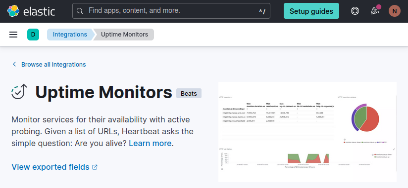
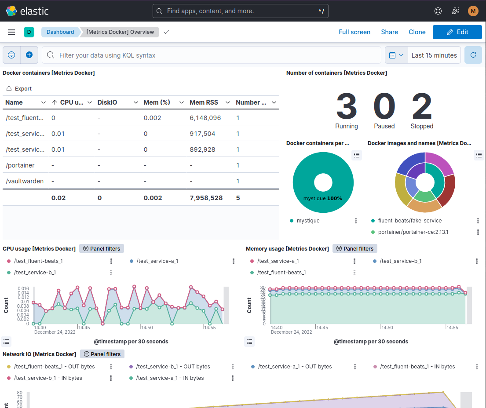
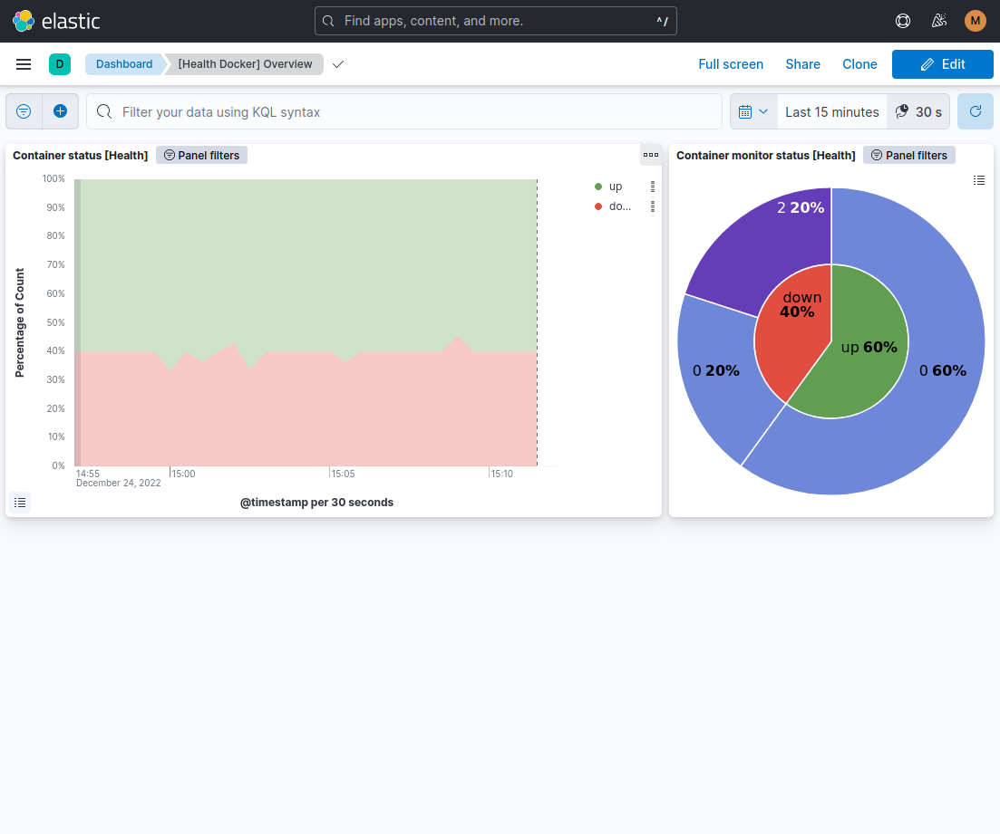

# Provided assets

## Kibana Uptime Monitors Setup Script

In recent Elastic Observability versions, the [Uptime Monitors](https://www.elastic.co/guide/en/uptime/7.9/uptime-app.html) does not share the same data used by [Synthetics](https://www.elastic.co/pt/observability/synthetic-monitoring) as it used to.



It means that default index templates, required to create datastreams on demand, will not be present.

So the Uptime Monitors will not be acessible straight away when you start sending container uptime records from FluentBeats.

To fix that you can use our setup script, you just need to do it once, following this 2 step procedure:

1- Save your ElasticSearch host/password locally the same files used to run it locally FluentBeats:

- /test/secrets/http_host.txt: contains the ES hostname
- /test./secrets/http_host.txt: contains the ES password

2- Create the index template:

``` shell
cd /assets/uptime/
./setup.sh
```

You should see a success message on shell output and you are ready to go.

## Kibana Dashboards

 The dashboards can be imported right into **Kibana Saved Objects**, following the menu:
 * Management > Kibana > Saved Objects
   - :arrow_down: Import
---

 Asset file                 | Screenshot
----------------------------|----------------------------------------------------------------
 docker-dashboard.ndjson    | 
 health-dashboard.ndjson    | 


---
## AWS Cloudformation

Examples to apply **Fluent Beats** observability using [AWS ECS](https://docs.aws.amazon.com/ecs/)

- fake-service.yml: Observable **ECS task** deploy
- fluent-beatas.yml: Fluent Beats **ECS daemon** deploy